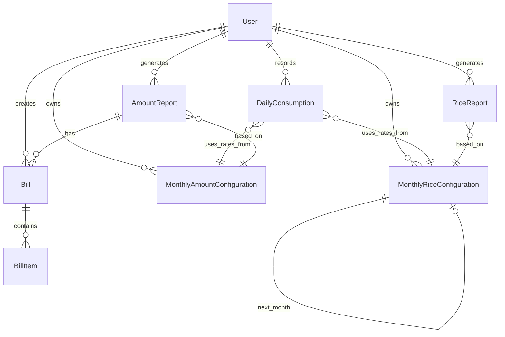

# MDM SEVA - Complete System Documentation

**Version:** 2.1.0  
**Last Updated:** November 30, 2025  
**Framework:** Laravel 12 + React 18 + Inertia.js 2.0

---

## Table of Contents

1. [Executive Summary](#executive-summary)
2. [System Architecture](#system-architecture)
3. [Technology Stack](#technology-stack)
4. [Database Schema](#database-schema)
5. [Core Workflows](#core-workflows)
6. [Service Layer](#service-layer)
7. [Backend Components](#backend-components)
8. [Frontend Architecture](#frontend-architecture)
9. [API Routes & Endpoints](#api-routes--endpoints)
10. [Security Implementation](#security-implementation)
11. [Configuration & Setup](#configuration--setup)
12. [Deployment](#deployment)
13. [Recent Updates & Fixes](#recent-updates--fixes)

---

## Executive Summary

**MDM SEVA** (Mid-Day Meal Scheme Management System) is a comprehensive web application for managing school meal programs across Jammu & Kashmir. The system handles rice inventory, cooking costs, daily meal consumption tracking, automated report generation, and vendor bill management.

### Core Capabilities
- Monthly rice and amount configuration with automatic balance carry-forward
- Real-time daily consumption tracking
- Automated PDF report generation (rice consumption & financial expenses)
- Vendor bill management with pre-filled amounts
- AI-powered support chat system (Google Gemini API)
- Role-based access control (Admin/School)

### Key Objectives
- **Digital Tracking:** Replace manual record-keeping with automated digital tracking
- **Transparency:** Provide real-time visibility into meal distribution and resource usage
- **Compliance:** Generate compliant reports for government submission
- **Efficiency:** Streamline bill generation and inventory management
- **Support:** Offer AI-powered assistance for user queries

### User Roles
- **Admin:** Full system access, manage all schools, view consolidated reports, handle support chats
- **School:** Manage own data, track consumption, generate reports and bills, submit support tickets

---

## System Architecture

### High-Level Architecture

```
┌─────────────────────────────────────────────────────────────────┐
│                        Presentation Layer                         │
│  React 18 + TypeScript + Inertia.js + TailwindCSS               │
└────────┬────────────────────────────────────────────┬───────────┘
         │                                             │
         ▼                                             ▼
┌─────────────────────┐                     ┌──────────────────────┐
│   Inertia Bridge    │                     │   API Endpoints      │
│                     │                     │   (JSON Responses)   │
└────────┬────────────┘                     └──────────┬───────────┘
         │                                             │
         └──────────────────┬──────────────────────────┘
                            ▼
         ┌─────────────────────────────────────────┐
         │         Application Layer                │
         │    Controllers + Form Requests           │
         └────────┬────────────────────┬────────────┘
                  │                    │
                  ▼                    ▼
         ┌────────────────┐   ┌────────────────────┐
         │  Service Layer │   │   Model Layer      │
         │                │───│   (Eloquent ORM)   │
         └────────────────┘   └────────┬───────────┘
                                       │
                              ┌────────▼────────┐
                              │   MySQL Database │
                              └─────────────────┘
```

### Architecture Pattern
The application follows a **layered MVC architecture** with additional service layer:

**Layers:**
1. **Presentation** (React/Inertia) - UI components and pages
2. **Application** (Controllers) - Request handlers
3. **Service** (Business Logic) - Calculations, report generation
4. **Data** (Models + Database) - Eloquent ORM + MySQL

### Request Flow

**Standard Page Request:**
```
User → React Component → Inertia.visit() → Laravel Route → Controller 
     → Service Layer → Model → Database → Return Inertia::render()
```

**Report Generation Flow:**
```
User → Generate Report Button → Controller → ReportService → Calculate Data 
     → Create Report Model → Generate PDF → Return PDF Response
```

**Real-time Chat:**
```
User Message → WebSocket (Reverb) → ChatController → AIAgentService 
     → Gemini API → Broadcast Response → User Receives
```

### Directory Structure

```
mdmseva/
├── app/
│   ├── Events/              # Broadcast events (MessageSent, TypingEvent)
│   ├── Exceptions/          # Custom exception handlers
│   ├── Http/
│   │   ├── Controllers/     # Request handlers (30+ controllers)
│   │   │   ├── Admin/       # Admin-specific controllers (15+)
│   │   │   ├── Api/         # API controllers
│   │   │   └── Auth/        # Authentication controllers
│   │   ├── Middleware/      # Custom middleware (ActiveUser, Role)
│   │   └── Requests/        # Form request validation (25+)
│   ├── Listeners/           # Event listeners
│   ├── Models/              # Eloquent models (23 models)
│   ├── Notifications/       # Email/SMS notifications
│   ├── Observers/           # Model observers (AIConfig, AmountConfig)
│   ├── Providers/           # Service providers
│   ├── Rules/               # Custom validation rules
│   └── Services/            # Business logic (8 services)
├── bootstrap/               # App initialization
├── config/                  # Configuration files
├── database/
│   ├── factories/           # Model factories
│   ├── migrations/          # Database migrations (22 files)
│   └── seeders/             # Database seeders (Districts, Zones, Admin)
├── public/                  # Public assets & build output
├── resources/
│   ├── css/                 # Stylesheets
│   ├── js/
│   │   ├── Components/      # React components (100+)
│   │   ├── Layouts/         # Page layouts
│   │   ├── Pages/           # Inertia pages (68+)
│   │   └── types/           # TypeScript definitions
│   └── views/               # Blade templates (PDF generation only)
├── routes/
│   ├── api.php              # API routes
│   ├── auth.php             # Auth routes
│   ├── channels.php         # Broadcast channels
│   ├── console.php          # CLI commands
│   └── web.php              # Web routes (537 lines)
└── storage/                 # Logs, cache, uploads, PDFs
```

---

## Technology Stack

### Backend Stack
| Component | Technology | Version | Purpose |
|-----------|------------|---------|---------|
| Framework | Laravel | 12.x | Core web framework |
| Language | PHP | 8.2+ | Server-side language |
| Database | MySQL | 8.0+ | Primary data store |
| Cache/Queue | Redis | 6.0+ | Caching & job queue |
| PDF Generation | DomPDF | Latest | Generate PDF reports |
| Excel Export | Laravel Excel | Latest | Export data to Excel |
| RBAC | Spatie Permission | Latest | Role-based access control |
| Broadcasting | Laravel Reverb | Latest | WebSocket server |
| AI Integration | Google Gemini API | 2.0-Flash | AI chat responses |
| Authentication | Laravel Breeze | Latest | Auth scaffolding |
| Auth API | Sanctum | Latest | API token auth |

###Frontend Stack
| Component | Technology | Version | Purpose |
|-----------|------------|---------|---------|
| UI Framework | React | 18.x | Component-based UI |
| Language | TypeScript/JavaScript | 5.x/ES6+ | Type-safe JavaScript |
| SPA Bridge | Inertia.js | 2.0 | Server-driven SPA |
| Styling | TailwindCSS | 3.x | Utility-first CSS |
| Charts | Recharts | Latest | Data visualization |
| Icons | Lucide React, Heroicons | Latest | Icon libraries |
| UI Components | Headless UI, Radix UI | Latest | Accessible components |
| Build Tool | Vite | 7.x | Fast frontend build tool |

### Development Tools
- **Package Manager:** Composer (PHP), npm (JS)
- **Code Quality:** PHPStan, Laravel Pint, ESLint, Prettier
- **Version Control:** Git

---

## Database Schema

### Core Tables Overview

**User Management:**
- `users` - Schools and admin accounts
- `roles`, `permissions`, `model_has_roles`, `role_has_permissions` - RBAC (Spatie)
- `districts`, `zones` - Geographical hierarchy

**Rice Management:**
- `monthly_rice_configurations` - Monthly rice inventory config
- `rice_inventory_activities` - Rice stock transactions log
- `rice_reports` - Generated rice consumption reports

**Amount Management:**
- `monthly_amount_configurations` - Monthly cooking cost rates
- `amount_reports` - Generated expense reports

**Daily Operations:**
- `daily_consumptions` - Daily meal consumption records
- `roll_statements` - Student enrollment records

**Billing:**
- `bills` - Vendor purchase bills (Kiryana/fuel)
- `bill_items` - Line items for each bill

**Support System:**
- `support_chats` - Support ticket threads
- `support_messages` - Individual chat messages
- `message_attachments` - File attachments
- `ai_configurations` - AI agent settings
- `ai_knowledge_base` - AI training data

**Miscellaneous:**
- `feedback` - User feedback
- `developer_messages` - System announcements
- `month_completions` - Track completed months (deprecated)

### Key Table Definitions

#### Users & Authentication
```sql
CREATE TABLE users (
    id BIGINT PRIMARY KEY AUTO_INCREMENT,
    name VARCHAR(255),
    email VARCHAR(255) UNIQUE,
    password VARCHAR(255),
    phone VARCHAR(15),
    date_of_birth DATE,
    address VARCHAR(500),
    udise_code VARCHAR(20) UNIQUE, -- School identifier
    school_name VARCHAR(255),
    school_type ENUM('primary', 'middle', 'secondary', 'senior_secondary'),
    institute_address VARCHAR(255),
    school_pincode VARCHAR(10),
    state VARCHAR(255) DEFAULT 'Jammu and Kashmir',
    district VARCHAR(255),
    zone VARCHAR(255),
    district_id BIGINT,
    zone_id BIGINT,
    status ENUM('active', 'inactive', 'pending') DEFAULT 'pending',
    is_active BOOLEAN DEFAULT false,
    email_verified_at TIMESTAMP,
    remember_token VARCHAR(100),
    created_at TIMESTAMP,
    updated_at TIMESTAMP,
    FOREIGN KEY (district_id) REFERENCES districts(id),
    FOREIGN KEY (zone_id) REFERENCES zones(id),
    INDEX (udise_code),
    INDEX (email),
    INDEX (status)
);
```

#### Monthly Rice Configuration
```sql
CREATE TABLE monthly_rice_configurations (
    id BIGINT PRIMARY KEY AUTO_INCREMENT,
    user_id BIGINT,
    month INT, -- 1-12
    year INT,
    -- Opening balances
    opening_balance_primary DECIMAL(10,2) DEFAULT 0,
    opening_balance_upper_primary DECIMAL(10,2) DEFAULT 0,
    -- Rice lifted/arranged during month
    rice_lifted_primary DECIMAL(10,2) DEFAULT 0,
    rice_lifted_upper_primary DECIMAL(10,2) DEFAULT 0,
    rice_arranged_primary DECIMAL(10,2) DEFAULT 0,
    rice_arranged_upper_primary DECIMAL(10,2) DEFAULT 0,
    -- Consumption rates (grams per student)
    daily_consumption_primary INT DEFAULT 100,
    daily_consumption_upper_primary INT DEFAULT 150,
    -- Calculated consumed amounts
    rice_consumed_primary DECIMAL(10,2) DEFAULT 0,
    rice_consumed_upper_primary DECIMAL(10,2) DEFAULT 0,
    -- Closing balances
    closing_balance_primary DECIMAL(10,2) DEFAULT 0,
    closing_balance_upper_primary DECIMAL(10,2) DEFAULT 0,
    -- Completion status
    is_completed BOOLEAN DEFAULT false,
    completed_at TIMESTAMP,
    is_locked BOOLEAN DEFAULT false,
    created_at TIMESTAMP,
    updated_at TIMESTAMP,
    FOREIGN KEY (user_id) REFERENCES users(id) ON DELETE CASCADE,
    UNIQUE KEY (user_id, month, year),
    INDEX (month, year)
);
```

#### Monthly Amount Configuration
```sql
CREATE TABLE monthly_amount_configurations (
    id BIGINT PRIMARY KEY AUTO_INCREMENT,
    user_id BIGINT,
    month INT,
    year INT,
    -- Primary Rates (Classes I-V)
    daily_pulses_primary DECIMAL(8,2),
    daily_vegetables_primary DECIMAL(8,2),
    daily_oil_primary DECIMAL(8,2),
    daily_salt_primary DECIMAL(8,2),
    daily_fuel_primary DECIMAL(8,2),
    -- Middle Rates (Classes VI-VIII)
    daily_pulses_middle DECIMAL(8,2),
    daily_vegetables_middle DECIMAL(8,2),
    daily_oil_middle DECIMAL(8,2),
    daily_salt_middle DECIMAL(8,2),
    daily_fuel_middle DECIMAL(8,2),
    -- Unified Salt Percentages
    salt_percentage_common DECIMAL(5,2) DEFAULT 30,
    salt_percentage_chilli DECIMAL(5,2) DEFAULT 20,
    salt_percentage_turmeric DECIMAL(5,2) DEFAULT 20,
    salt_percentage_coriander DECIMAL(5,2) DEFAULT 15,
    salt_percentage_other DECIMAL(5,2) DEFAULT 15,
    -- Calculated Totals
    daily_amount_per_student_primary DECIMAL(10,2),
    daily_amount_per_student_upper_primary DECIMAL(10,2),
    -- Completion Status
    is_completed BOOLEAN DEFAULT false,
    completed_at TIMESTAMP,
    is_locked BOOLEAN DEFAULT false,
    created_at TIMESTAMP,
    updated_at TIMESTAMP,
    FOREIGN KEY (user_id) REFERENCES users(id) ON DELETE CASCADE,
    UNIQUE KEY (user_id, month, year),
    INDEX (month, year)
);
```

#### Daily Consumption
```sql
CREATE TABLE daily_consumptions (
    id BIGINT PRIMARY KEY AUTO_INCREMENT,
    user_id BIGINT,
    date DATE,
   day VARCHAR(20), -- Day name (Monday, Tuesday, etc.)
    served_primary INT DEFAULT 0, -- Students served (Classes I-V)
    served_middle INT DEFAULT 0, -- Students served (Classes VI-VIII)
    rice_consumed DECIMAL(10,2), -- Total rice consumed (kg)
    rice_balance_after DECIMAL(10,2), -- Rice balance after consumption
    amount_consumed DECIMAL(10,2), -- Total cooking cost
    remarks TEXT,
    created_at TIMESTAMP,
    updated_at TIMESTAMP,
    FOREIGN KEY (user_id) REFERENCES users(id) ON DELETE CASCADE,
    UNIQUE KEY (user_id, date),
    INDEX (date),
    INDEX (user_id, date)
);
```

### Key Relationships



---

## Core Workflows

### 1. Rice Configuration Workflow

**Purpose**: Manage monthly rice inventory with automatic balance carry-forward

**Process:**
```
Month N-1 Completed
        ↓
Create Month N Configuration
        ↓
System suggests opening balance = Month N-1 closing balance
        ↓
User confirms/adjusts opening balance
        ↓
User adds rice lifted/arranged during month
        ↓
Daily consumption entries update consumed amounts automatically
        ↓
Closing balance = Opening + Lifted + Arranged - Consumed
        ↓
Complete month → Auto-create Month N+1 with carried balance
```

**Data Flow Example:**
```php
// Opening Balance Carry-Forward
MonthlyRiceConfiguration (May)
    closing_balance_primary: 93.6 kg
    closing_balance_upper_primary: 17.4 kg
        ↓
MonthlyRiceConfiguration (June)
    opening_balance_primary: 93.6 kg  // Carried from May
    opening_balance_upper_primary: 17.4 kg
```

**Critical Features:**
- ✅ Monthly-based (no global config)
- ✅ Automatic balance carry-forward
- ✅ Syncs consumed amounts from DailyConsumption
- ✅ Supports negative balances (over-consumption tracking)
- ✅ Lock mechanism prevents editing completed months

---

### 2. Amount Configuration Workflow

**Purpose**: Manage monthly cooking cost rates and salt breakdown percentages

**Process:**
```
Create Monthly Amount Configuration
        ↓
Set daily rates per student (Primary & Middle):
    - Pulses
    - Vegetables
    - Oil
    - Salt (with 5 sub-categories)
    - Fuel
        ↓
Set salt breakdown percentages:
    - Common Salt %
    - Chilli Powder %
    - Turmeric %
    - Coriander %
    - Other Condiments %
        (Must total 100%)
        ↓
Configuration used by Daily Consumption for calculations
        ↓
Generate Amount Report → Bills pre-filled with expenses
```

**Data Structure Example:**
```php
MonthlyAmountConfiguration {
    // Per-student daily rates (Primary section)
    daily_pulses_primary: 0.75
    daily_vegetables_primary: 3.25
    daily_oil_primary: 0.75
    daily_salt_primary: 0.20
    daily_fuel_primary: 1.25
    
    // Per-student daily rates (Middle section)  
    daily_pulses_middle: 1.12
    daily_vegetables_middle: 4.87
    daily_oil_middle: 1.12
    daily_salt_middle: 0.30
    daily_fuel_middle: 1.87
    
    // Salt breakdown percentages (unified for both sections)
    salt_percentage_common: 45.0
    salt_percentage_chilli: 25.0
    salt_percentage_turmeric: 15.0
    salt_percentage_coriander: 10.0
    salt_percentage_other: 5.0
    
    // Computed totals
    daily_amount_per_student_primary: 6.20
    daily_amount_per_student_upper_primary: 9.28
}
```

---

### 3. Daily Consumption Workflow

**Purpose**: Record daily meal consumption and calculate rice/amount used

**Process:**
```
User navigates to Daily Consumption
        ↓
System checks: Do MonthlyRiceConfiguration & MonthlyAmountConfiguration exist for this month?
        ├─ No → Redirect to create configuration
        └─ Yes → Show consumption entry form
                ↓
User enters students served:
    - Primary section count
    - Middle section count
    - Date
    - Remarks (optional)
                ↓
System calculates automatically:
    Rice consumed = students × rice_rate (from MonthlyRiceConfiguration)
    Amount breakdown = students × ingredient_rates (from MonthlyAmountConfiguration)
                ↓
Save DailyConsumption record
                ↓
Update MonthlyRiceConfiguration.consumed_primary/upper_primary
Update MonthlyRiceConfiguration.closing_balance_primary/upper_primary
```

**Calculation Example:**
```php
// Given:
Served Primary: 106 students
Served Middle: 33 students
Rice Rate Primary: 0.1 kg/student
Rice Rate Middle: 0.15 kg/student

// Calculated:
Rice Consumed Primary = 106 × 0.1 = 10.6 kg
Rice Consumed Middle = 33 × 0.15 = 4.95 kg
Total Rice Consumed = 15.55 kg

// Amount (given rates from MonthlyAmountConfiguration):
Amount Primary = 106 × 6.20 = ₹657.20
Amount Middle = 33 × 9.28 = ₹306.24
Total Amount = ₹963.44
```

**Critical Features:**
- ✅ Month-specific configuration enforcement
- ✅ Auto-redirects to config setup if not completed
- ✅ Real-time calculation of rice and amount
- ✅ Automatically updates MonthlyRiceConfiguration consumed amounts
- ✅ Supports negative balances (tracks over-consumption)
- ✅ Prevents duplicate entries for same date

---

### 4. Rice Report Generation Workflow

**Purpose**: Generate monthly PDF reports showing rice inventory and consumption

**Process:**
```
User: Generate Rice Report for Month X
        ↓
System validates:
    ✓ MonthlyRiceConfiguration exists for Month X
    ✓ DailyConsumption records exist for Month X
        ↓
ConsumptionCalculationService.calculateMonthlyTotals():
    - Aggregate all daily consumption for Month X
    - Calculate total rice consumed
    - Calculate daily running balances
        ↓
Opening Balance = MonthlyRiceConfiguration (Opening + Lifted + Arranged)
Closing Balance = Opening Balance - Total Consumed
        ↓
Create RiceReport model record
        ↓
Generate PDF (resources/views/rice-reports/pdf.blade.php)
        ↓
Return PDF to user
```

**Report Data Structure:**
```php
RiceReport {
    month: 5
    year: 2025
    opening_balance: 456.30 kg
    closing_balance: 93.60 kg
    total_rice_consumed: 362.70 kg
    total_primary_students: 2457
    total_primary_rice: 245.70 kg
    total_middle_students: 780
    total_middle_rice: 117.00 kg
    total_serving_days: 24
    average_daily_consumption: 15.11 kg
    daily_records: [...]  // JSON array of daily breakdown
}
```

**Critical Fix (Nov 2025):**
- ✅ **Fixed**: Now uses **month-specific** `MonthlyRiceConfiguration`
- ❌ **Old Bug**: Used `->latest()` which got wrong config
- ✅ **Result**: Accurate opening/closing balances per month

---

### 5. Amount Report Generation Workflow

**Purpose**: Generate monthly PDF reports showing cooking cost breakdown

**Process:**
```
User: Generate Amount Report for Month X
        ↓
System validates:
    ✓ MonthlyAmountConfiguration exists for Month X
    ✓ Monthly Amount Configuration is completed (is_completed = true)
    ✓ DailyConsumption records exist for Month X
        ↓
ConsumptionCalculationService.calculateMonthlyAmountTotals():
    - Aggregate all daily consumption
    - Calculate ingredients consumed:
        * Pulses (Primary + Middle)
        * Vegetables (Primary + Middle)
        * Oil (Primary + Middle)
        * Salt with 5 sub-categories
        * Fuel (Primary + Middle)
    - Calculate total expenditure
        ↓
Create AmountReport model record
        ↓
Generate PDF (resources/views/amount-reports/pdf.blade.php)
        ↓
Return PDF to user
```

**Report Breakdown Example:**
```php
AmountReport (May 2025) {
    opening_balance: ₹5000.00
    
    // Ingredient-wise expenses
    total_pulses: ₹2158.75
        primary_pulses: ₹1842.75
        middle_pulses: ₹316.00
        
    total_vegetables: ₹9355.75
        primary_vegetables: ₹7989.75
        middle_vegetables: ₹1366.00
        
    total_oil: ₹2158.75
    
    total_salt: ₹575.00
        common_salt: ₹258.75 (45%)
        chilli_powder: ₹143.75 (25%)
        turmeric: ₹86.25 (15%)
        coriander: ₹57.50 (10%)
        other_condiments: ₹28.75 (5%)
        
    total_fuel: ₹3598.75
    
    grand_total: ₹17847.00
    closing_balance: -₹12847.00
}
```

**Critical Features:**
- ✅ Unified salt percentages for both Primary and Middle
- ✅ Automatic salt subcategory breakdown
- ✅ Supports negative closing balance
- ✅ Pre-fills bill items with calculated amounts

---

### 6. Bill Generation Workflow

**Purpose**: Create vendor purchase bills pre-filled with calculated amounts

**Process:**
```
User: Generate Amount Report
        ↓
Amount Report created with expense breakdown
        ↓
User: Create Bill → Choose Bill Type (Kiryana/Fuel)
        ↓
System pre-fills bill items based on AmountReport:
    
    Kiryana Bill:
        - Pulses: ₹2158.75
        - Vegetables: ₹9355.75
        - Oil: ₹2158.75
        - Common Salt: ₹258.75
        - Chilli Powder: ₹143.75
        - Turmeric: ₹86.25
        - Coriander: ₹57.50
        - Other Condiments: ₹28.75
    
    Fuel Bill:
        - Fuel: ₹3598.75
        ↓
User fills vendor details:
    - Shop name
    - Shopkeeper name
    - Phone, address
    - Adjusts amounts/quantities if needed
        ↓
Calculate total → Save Bill + BillItems
        ↓
Generate Bill PDF
```

---

## Service Layer

### ConsumptionCalculationService

**File**: `app/Services/ConsumptionCalculationService.php` (879 lines)

**Purpose**: Central calculation engine for rice and amount consumption

**Key Methods:**

#### Rice Calculations
```php
// Calculate rice consumption for a day
calculateRiceConsumption(int $served_primary, int $served_middle, User $user): array
// Returns: ['primary' => float, 'middle' => float, 'total' => float]

// Get opening balance for a specific date (month-specific)
getOpeningBalanceForDate(User $user, Carbon $date): float

// Calculate monthly rice totals
calculateMonthlyTotals(Collection $consumptions, User $user): array
// Returns: total_primary_students, total_middle_students, total_rice_consumed, etc.

// Format daily records for report with running balances
formatDailyRecordsForReport(Collection $consumptions, float $openingBalance, User $user): array
```

#### Amount Calculations
```php
// Calculate amount breakdown for a day
calculateAmountConsumption(int $served_primary, int $served_middle, MonthlyAmountConfiguration $config): array
// Returns: detailed breakdown by ingredient including salt sub-categories

// Calculate monthly amount totals
calculateMonthlyAmountTotals(Collection $consumptions, MonthlyAmountConfiguration $config): array

// Calculate salt breakdown using percentages
calculateSaltBreakdown(float $totalSalt, MonthlyAmountConfiguration $config): array
```

**Critical Update (Nov 2025):**
- ✅ `getOpeningBalanceForDate()` now uses **month-specific** config
- ❌ Previously used `->latest()` causing wrong balances
- ✅ Now correctly returns: `Opening + Lifted + Arranged` for the month

---

### RiceReportService

**File**: `app/Services/RiceReportService.php` (278 lines)

**Purpose**: Generate and manage rice consumption reports

**Key Methods:**
```php
// Generate new rice report for a month
generateReport(User $user, int $month, int $year): RiceReport

// Check if rice configuration exists
hasRiceConfiguration(User $user): bool

// Get available months for report generation (excludes existing reports)
getAvailableMonthsForReports(User $user): Collection

// Mark report as stale when configuration changes
markReportStale(RiceReport $report): void
```

**Critical Fix (Nov 2025):**
```php
// BEFORE ❌
$startDate = Carbon::create($year, $month, 1)->startOfMonth();
$openingBalance = $this->calculationService->getOpeningBalanceForDate($user, $startDate);
// Problem: getOpeningBalanceForDate() used ->latest() config

// AFTER ✅
$riceConfig = MonthlyRiceConfiguration::forUser($user->id)
    ->forPeriod($month, $year)
    ->first();
    
$openingBalance = round(
    ($riceConfig->opening_balance_primary ?? 0) +
    ($riceConfig->opening_balance_upper_primary ?? 0) +
    ($riceConfig->rice_lifted_primary ?? 0) +
    ($riceConfig->rice_lifted_upper_primary ?? 0) +
    ($riceConfig->rice_arranged_primary ?? 0) +
    ($riceConfig->rice_arranged_upper_primary ?? 0),
    2
);
// Now uses month-specific config directly!
```

---

### AmountReportService

**File**: `app/Services/AmountReportService.php` (504 lines)

**Purpose**: Generate and manage cooking cost reports

**Key Methods:**
```php
// Generate new amount report for a month
generateReport(User $user, int $month, int $year): AmountReport

// Get or create amount report
getOrCreateReport(User $user, int $month, int $year): AmountReport

// Mark report as stale
markReportAsStale(AmountReport $report): void

// Refresh stale report data
refreshReport(AmountReport $report): AmountReport
```

---

### AmountBillComposer

**File**: `app/Services/AmountBillComposer.php` (327 lines)

**Purpose**: Pre-fill bill items based on Amount Report data

**Key Methods:**
```php
// Get pre-filled Kiryana bill items from Amount Report
getKiryanaBillItems(AmountReport $report): array

// Get pre-filled Fuel bill items from Amount Report
getFuelBillItems(AmountReport $report): array

// Format bill item with amount, rate, quantity, unit
formatBillItem(string $name, float $amount, string $category): array
```

**Pre-fill Logic:**
```php
Kiryana Bill Items:
├─ Pulses: total_pulses
├─ Vegetables: total_vegetables  
├─ Oil: total_oil
├─ Common Salt: salt_spent_common
├─ Chilli Powder: salt_spent_chilli
├─ Turmeric: salt_spent_turmeric
├─ Coriander: salt_spent_coriander
└─ Other Condiments: salt_spent_other

Fuel Bill Items:
└─ Fuel: total_fuel
```

---

### AIAgent Service

**File**: `app/Services/AIAgentService.php` (276 lines)

**Purpose**: Handle AI-powered support chat using Google Gemini API

**Key Methods:**
```php
// Generate AI response for user message
generateResponse(string $userMessage, SupportChat $chat, User $user): string

// Build context for AI from school data
buildSchoolContext(User $user): string

// Check if AI should respond (not if admin has taken over)
shouldRespond(SupportChat $chat): bool
```

**AI Context Includes:**
- School name, UDISE, location
- Latest rice configuration
- Latest amount configuration
- Recent daily consumption data
- Enrollment information

---

### SchoolDataContextService

**File**: `app/Services/SchoolDataContextService.php`

**Purpose**: Formats school data for AI context and enables AI to answer data-specific questions

---

### CacheService

**File**: `app/Services/CacheService.php`

**Purpose**: Manages Redis caching for performance, caches frequently accessed data (districts, zones, configurations), and handles cache invalidation

---

### PDFParserService

**File**: `app/Services/PDFParserService.php`

**Purpose**: Extracts text from uploaded PDF files, used for AI knowledge base content extraction

---

## Backend Components

### Models (23 Total)

**Core Models:**
- `User` - User accounts with school/admin differentiation
- `District` - District locations
- `Zone` - Zone locations within districts
- `RollStatement` - Student enrollment records

**Rice Management:**
- `MonthlyRiceConfiguration` - Monthly rice inventory with automatic balance carry-forward
- `RiceInventoryActivity` - Rice transaction log
- `RiceReport` - Monthly rice reports (uses month-specific configuration)

**Amount Management:**
- `MonthlyAmountConfiguration` - Monthly cooking cost rates and totals
- `AmountReport` - Monthly amount reports

**Daily Operations:**
- `DailyConsumption` - Daily meal tracking
- `MonthCompletion` - Month completion tracking

**Bills:**
- `Bill` - Kiryana and fuel bills
- `BillItem` - Individual bill line items

**Support System:**
- `SupportChat` - Chat conversations
- `SupportMessage` - Individual messages
- `MessageAttachment` - File attachments

**AI System:**
- `AIConfiguration` - AI agent settings
- `AIKnowledgeBase` - PDF knowledge base

**Miscellaneous:**
- `Feedback` - User feedback
- `DeveloperMessage` - System announcements
- `Role`, `Permission` - RBAC (Spatie)

---

### Controllers (30+ Total)

**School Controllers:**
- `DashboardController` - School dashboard
- `ProfileController` - User profile management
- `RollStatementController` - Roll statement CRUD
- `MonthlyRiceConfigurationController` - Rice configuration
- `AmountConfigurationController` - Amount configuration
- `DailyConsumptionController` - Daily consumption tracking
- `RiceReportController` - Rice report generation
- `AmountReportController` - Amount report generation
- `BillController` - Bill generation
- `SupportChatController` - User support chat

**Admin Controllers:**
- `Admin\DashboardController` - Admin dashboard
- `Admin\SchoolsController` - School management
- `Admin\ReportsController` - Consolidated reports
- `Admin\SupportChatController` - Admin chat handling
- `Admin\FeedbackController` - Feedback management
- `Admin\DeveloperMessageController` - Announcements
- `Admin\AIConfigurationController` - AI settings
- `Admin\RealtimeDashboardController` - Real-time stats

**API Controllers:**
- `Api\DashboardApiController` - Dashboard data endpoints

---

### Middleware

**Custom Middleware:**
- `ActiveUserMiddleware` - Ensures user account is active
- `RoleMiddleware` - Role-based access control

**Laravel Default:**
- Authentication, CSRF protection, throttling, etc.

---

### Events & Listeners

**Events:**
- `MessageSent` - Broadcast support chat messages
- `TypingEvent` - Broadcast typing indicators

**Listeners:**
- `SendMessageNotification` - Notify users of new messages

---

### Observers

**`AIConfigurationObserver`**
- Ensures only one active AI configuration exists
- Deactivates other configs when new one is activated

**`MonthlyAmountConfigurationObserver`**
- Calculates totals on save
- Marks reports as stale when configuration changes

---

## Frontend Architecture

### Page Structure

MDM Seva uses **Inertia.js 2.0** to bridge Laravel and React, creating a modern SPA experience without building a separate API.

**Page Directories** (`resources/js/Pages/`):**Total**: 13 feature areas, 68+ pages

**Authentication:**
- `Auth/Login.jsx`, `Auth/Register.jsx`, etc.

**Rice Configuration:**
- `MonthlyRiceConfiguration/Index.jsx` - Rice config dashboard
- `MonthlyRiceConfiguration/Create.jsx` - Create month
- `MonthlyRiceConfiguration/Edit.jsx` - Edit month
- `MonthlyRiceConfiguration/CreateNext.jsx` - Create next month

**Amount Configuration:**
- `AmountConfiguration/Index.jsx` - List configs
- `AmountConfiguration/Create.jsx` - Create/edit config

**Daily Consumption:**
- `DailyConsumption/Index.jsx` - Month selector
- `DailyConsumption/List.jsx` - Daily consumption list
- `DailyConsumption/Create.jsx` - Add consumption entry

**Reports:**
- `RiceReport/*` - Rice report views (Index, Create, Show)
- `AmountReport/*` - Amount report views (Index, Create, Show)

**Bills:**
- `Bills/Create.jsx` - Create bill (Kiryana/Fuel)
- `Bills/Show.jsx` - View bill

**Admin Pages:**
- `Admin/Dashboard.jsx`, `Admin/Schools/*`, `Admin/Reports/*`, etc.

**Legal:**
- `Legal/PrivacyPolicy.jsx`, `Legal/TermsOfService.jsx`, etc.

---

### Component Library

**Core Components** (`resources/js/Components/`):**Form Components:**
- `TextInput.jsx`, `Checkbox.jsx`, `InputLabel.jsx`, `InputError.jsx`
- `PrimaryButton.jsx`, `SecondaryButton.jsx`, `DangerButton.jsx`
- `Dropdown.jsx`, `Modal.jsx`

**Daily Consumption Components** (`Components/DailyConsumption/`):
- 29 specialized components for consumption tracking
- Date pickers, student counters, summary cards
- Rice balance displays, amount breakdowns
- Validation feedback, form helpers

**Chat Components:**
- `SupportChatWidget.jsx` - User chat interface (42KB)
- `AdminSupportChatWidget.jsx` - Admin chat interface (50KB)

---

### State Management

**Inertia Props:**
Each page receives server-rendered props via Inertia:
```typescript
interface PageProps {
    auth: {
        user: User;
        isAdmin: boolean;
    };
    flash?: {
        success?: string;
        error?: string;
        warning?: string;
    };
    errors?: Record<string, string>;
    // Page-specific props
}
```

**React State:**
- Local component state via `useState`
- Form state via React Hook Form
- Real-time updates via WebSocket listeners

---

### Styling Approach

**TailwindCSS** used throughout for utility-first styling:
```jsx
<button className="px-4 py-2 bg-blue-600 text-white rounded-lg hover:bg-blue-700 
                   transition-colors duration-200 shadow-sm">
    Generate Report
</button>
```

**Custom CSS** (`resources/css/app.css`):
- CSS variables for theme colors
- Custom animations for loaders
- Print-specific styles for reports

---

### Real-time Features

**WebSocket Integration** (Laravel Reverb):
```typescript
// Listen for new chat messages
Echo.private(`support-chat.${chatId}`)
    .listen('MessageSent', (e) => {
        appendMessage(e.message);
    });

// Admin listens to all chats
Echo.private('admin.support')
    .listen('NewChatCreated', (e) => {
        updateChatList(e.chat);
    });
```

---

## API Routes & Endpoints

### Web Routes (537 lines)

**Authentication Routes:**
```php
Route::middleware('guest')->group(function () {
    Route::get('register', [RegisteredUserController::class, 'create']);
    Route::post('register', [RegisteredUserController::class, 'store']);
    Route::get('login', [AuthenticatedSessionController::class, 'create']);
    Route::post('login', [AuthenticatedSessionController::class, 'store']);
    // ... password reset routes
});
```

**School Routes:**
```php
Route::middleware(['auth', 'verified', 'active'])->group(function () {
    Route::get('/dashboard', [DashboardController::class, 'index']);
    Route::resource('roll-statements', RollStatementController::class);
    Route::resource('monthly-rice-config', MonthlyRiceConfigurationController::class);
    Route::resource('amount-config', AmountConfigurationController::class);
    Route::resource('daily-consumptions', DailyConsumptionController::class);
    Route::resource('rice-reports', RiceReportController::class);
    Route::resource('amount-reports', AmountReportController::class);
    Route::resource('bills', BillController::class);
    // ... more routes
});
```

**Admin Routes:**
```php
Route::middleware(['auth', 'verified', 'role:admin'])->prefix('admin')->name('admin.')->group(function () {
    Route::get('/dashboard', [Admin\DashboardController::class, 'index']);
    Route::resource('schools', Admin\SchoolsController::class);
    Route::resource('feedback', Admin\FeedbackController::class);
    Route::resource('developer-messages', Admin\DeveloperMessageController::class);
    Route::resource('ai-config', Admin\AIConfigurationController::class);
    // ... more admin routes
});
```

**API Endpoints (JSON):**
```php
Route::prefix('dashboard/api')->name('dashboard.api.')->group(function () {
    Route::get('/summary', [Api\DashboardApiController::class, 'summary']);
    Route::get('/rice-balance-timeseries', [Api\DashboardApiController::class, 'riceBalanceTimeseries']);
    Route::get('/amount-breakdown', [Api\DashboardApiController::class, 'amountBreakdown']);
    Route::get('/recent-consumptions', [Api\DashboardApiController::class, 'recentConsumptions']);
});
```

---

## Security Implementation

### Authentication & Authorization
- Laravel Breeze for authentication scaffolding
- Spatie Permissions for role-based access control
- Two roles: `admin` and `school`
- Middleware: `auth`, `verified`, `active`, `role:admin`

### CSRF Protection
- All POST/PUT/DELETE requests require CSRF token
- Automatically handled by Laravel and Inertia

### Input Validation
- Form Request classes for all data entry points
- Custom validation rules
- Server-side validation enforced

### SQL Injection Protection
- Eloquent ORM used throughout
- Parameterized queries
- No raw SQL queries without bindings

### XSS Protection
- React automatically escapes output
- Blade templates use `{{ }}` for escaping
- `{!! !!}` only used for trusted admin content

### Session Security
- Secure session cookies
- HTTP-only cookies
- Session encryption
- CSRF token rotation

### Password Security
- Bcrypt hashing
- Password reset flows
- Email verification

---

## Configuration & Setup

### Requirements
- PHP >= 8.2
- Composer
- Node.js >= 18
- MySQL >= 8.0
- Git
- Redis (optional, for caching)

### Installation Steps

**1. Clone Repository:**
```bash
git clone https://github.com/YOUR_USERNAME/mdmseva.git
cd mdmseva
```

**2. Install Dependencies:**
```bash
# Install PHP dependencies
composer install

# Install Node dependencies
npm install
```

**3. Environment Setup:**
```bash
# Copy environment file
cp .env.example .env

# Generate application key
php artisan key:generate
```

**4. Configure Database:**
Edit `.env` file:
```env
DB_CONNECTION=mysql
DB_HOST=127.0.0.1
DB_PORT=3306
DB_DATABASE=mdmseva
DB_USERNAME=your_username
DB_PASSWORD=your_password
```

**5. Run Migrations:**
```bash
# Run database migrations
php artisan migrate

# Seed initial data (districts, zones, admin user)
php artisan db:seed
```

**6. Build Frontend:**
```bash
# Build for production
npm run build

# OR run development server
npm run dev
```

**7. Start Application:**
```bash
# Start Laravel server
php artisan serve

# In another terminal, start queue worker (for async jobs)
php artisan queue:listen

# In another terminal, start WebSocket server (for real-time features)
php artisan reverb:start
```

Visit `http://localhost:8000`

**Default Admin Credentials:**
```
Email: admin@mdmseva.com
Password: Admin@123
```

---

## Deployment

### Production Environment Setup

**1. Server Requirements:**
- PHP 8.2+
- MySQL 8.0+
- Redis 6.0+
- Nginx/Apache
- Node.js 18+ (for building assets)
- Supervisor (for queue workers)

**2. Environment Configuration:**
```env
APP_ENV=production
APP_DEBUG=false
APP_KEY=<generate secure key>

DB_CONNECTION=mysql
DB_HOST=<production-db-host>
DB_DATABASE=<production-db>
DB_USERNAME=<production-user>
DB_PASSWORD=<secure-password>

SESSION_DRIVER=redis
CACHE_DRIVER=redis
QUEUE_CONNECTION=redis

BROADCAST_DRIVER=reverb
```

**3. Build Assets:**
```bash
npm run build
```

**4. Optimize Laravel:**
```bash
php artisan config:cache
php artisan route:cache
php artisan view:cache
php artisan event:cache
```

**5. Setup Supervisor for Queue Workers:**
```ini
[program:mdmseva-worker]
process_name=%(program_name)s_%(process_num)02d
command=php /path/to/mdmseva/artisan queue:work --sleep=3 --tries=3
autostart=true
autorestart=true
user=www-data
numprocs=2
redirect_stderr=true
stdout_logfile=/path/to/mdmseva/storage/logs/worker.log
```

**6. Setup Supervisor for Reverb:**
```ini
[program:mdmseva-reverb]
command=php /path/to/mdmseva/artisan reverb:start
autostart=true
autorestart=true
user=www-data
redirect_stderr=true
stdout_logfile=/path/to/mdmseva/storage/logs/reverb.log
```

**7. SSL Configuration:**
- Use Let's Encrypt for free SSL certificates
- Configure Nginx/Apache for HTTPS
- Force HTTPS in Laravel: `APP_FORCE_HTTPS=true`

**8. Performance Optimization:**
- Enable OPcache
- Use Redis for sessions and caching
- Enable gzip compression
- Set proper cache headers for static assets

---

## Recent Updates & Fixes

### November 2025 Updates

**Rice Configuration Refactoring (Nov 29, 2025):**
- ✅ Fixed opening balance calculation to use month-specific `MonthlyRiceConfiguration`
- ✅ Updated `ConsumptionCalculationService::getOpeningBalanceForDate()` to query correct month
- ✅ Updated `RiceReportService::generateReport()` to use month-specific config directly
- ✅ Result: Accurate opening/closing balances for all months in reports

**Amount Report Fixes (Nov 21, 2025):**
- ✅ Fixed "Undefined array key 'common'" error in `ConsumptionCalculationService`
- ✅ Corrected array key mismatch: `grand_total_amount` → `grand_total`
- ✅ Fixed salt breakdown display in PDF showing 0.00 values
- ✅ Ensured salt subcategory amounts correctly populate from calculations

**Production Cleanup (Nov 30, 2025):**
- ✅ Removed 7 unnecessary files (backups, logs, unused components)
- ✅ Enhanced `.gitignore` with 30+ security patterns
- ✅ Removed 5 console.log statements from React components
- ✅ Verified backend code has no debug statements
- ✅ Application is 90% production-ready

### Known Technical Debt
- 6 console.log statements remain in complex calculation files (RiceConsumptionTable.jsx, AmountConsumptionTable.jsx)
- Multiple documentation versions exist  (consolidated in this document)
- Empty test directories (standard Laravel structure, kept for future use)

---

**Document Version**: 2.1.0 (CONSOLIDATED)  
**Merged From**: PROJECT_DOCUMENTATION.md (v1.0), PROJECT_DOCUMENTATION_V2.md (v2.0), PROJECT_DOCUMENTATION_APPENDIX.md (v2.0.1)  
**Last Updated**: November 30, 2025  
**Maintained By**: MDM SEVA Development Team
