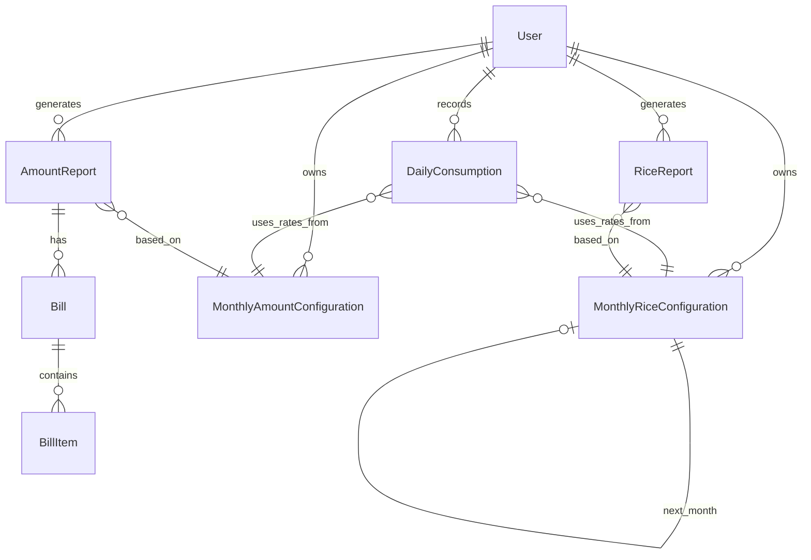

# MDM SEVA - Complete System Documentation

**Version:** 2.0.0  
**Last Updated:** November 29, 2025  
**Framework:** Laravel 12 + React 18 (TypeScript) + Inertia.js 2.0

---

## Executive Summary

**MDM Seva** is a comprehensive Laravel-React application for managing India's Mid-Day Meal Scheme in schools across Jammu & Kashmir. The system handles rice inventory, cooking costs, daily meal consumption tracking, automated report generation, and vendor bill management.

**Core Capabilities**:
- Monthly rice and amount configuration with automatic balance carry-forward
- Real-time daily consumption tracking
- Automated PDF report generation (rice consumption & financial expenses)
- Vendor bill management with pre-filled amounts
- AI-powered support chat system
- Role-based access control (Admin/School)

---

## Table of Contents

1. [System Architecture](#system-architecture)
2. [Technology Stack](#technology-stack)  
3. [Database Schema](#database-schema)
4. [Core Workflows](#core-workflows)
5. [Service Layer](#service-layer)
6. [Controllers & Routes](#controllers--routes)
7. [Frontend Architecture](#frontend-architecture)
8. [Recent Refactorings](#recent-refactorings)
9. [Dependencies & Integrations](#dependencies--integrations)
10. [Known Issues & Technical Debt](#known-issues--technical-debt)

---

## System Architecture

### High-Level Architecture

```
┌─────────────────────────────────────────────────────────────────┐
│                        Presentation Layer                         │
│  React 18 + TypeScript + Inertia.js + TailwindCSS               │
└────────┬────────────────────────────────────────────┬───────────┘
         │                                             │
         ▼                                             ▼
┌─────────────────────┐                     ┌──────────────────────┐
│   Inertia Bridge    │                     │   API Endpoints      │
│                     │                     │   (JSON Responses)   │
└────────┬────────────┘                     └──────────┬───────────┘
         │                                             │
         └──────────────────┬──────────────────────────┘
                            ▼
         ┌─────────────────────────────────────────┐
         │         Application Layer                │
         │    Controllers + Form Requests           │
         └────────┬────────────────────┬────────────┘
                  │                    │
                  ▼                    ▼
         ┌────────────────┐   ┌────────────────────┐
         │  Service Layer │   │   Model Layer      │
         │                │───│   (Eloquent ORM)   │
         └────────────────┘   └────────┬───────────┘
                                       │
                              ┌────────▼────────┐
                              │   MySQL Database │
                              └─────────────────┘
```

### Request Flow

**Standard Page Request**:
```
User → React Component → Inertia.visit() → Laravel Route → Controller → Service Layer → Model → Database
                                                                              │
                                                                              └→ Return Inertia::render()
```

**Report Generation Flow**:
```
User → Generate Report Button → Controller → ReportService → Calculate Data → Create Report Model → Generate PDF → Return PDF Response
```

**Real-time Chat**:
```
User Message → WebSocket (Reverb) → ChatController → AIAgentService → Gemini API → Broadcast Response → User Receives
```

---

## Technology Stack

### Backend Stack
| Component | Technology | Version | Purpose |
|-----------|------------|---------|---------|
| Framework | Laravel | 12.x | Core web framework |
| Language | PHP | 8.2+ | Server-side language |
| Database | MySQL | 8.0+ | Primary data store |
| Cache/Queue | Redis | 6.0+ | Caching & job queue |
| PDF Generation | DomPDF | Latest | Generate PDF reports |
| RBAC | Spatie Permission | Latest | Role-based access control |
| Broadcasting | Laravel Reverb | Latest | WebSocket server |
| AI Integration | Google Gemini API | 1.0 | AI chat responses |

### Frontend Stack
| Component | Technology | Version | Purpose |
|-----------|------------|---------|---------|
| UI Framework | React | 18.x | Component-based UI |
| Language | TypeScript | 5.x | Type-safe JavaScript |
| SPA Bridge | Inertia.js | 2.0 | Server-driven SPA |
| Styling | TailwindCSS | 3.x | Utility-first CSS |
| Charts | Recharts | Latest | Data visualization |
| Icons | Lucide React | Latest | Icon library |
| Forms | React Hook Form | Latest | Form management |

### Development Tools
- **Package Manager**: Composer (PHP), npm/yarn (JS)
- **Build Tool**: Vite
- **Code Quality**: PHP CS Fixer, ESLint, Prettier
- **Version Control**: Git

---

## Database Schema

### Core Tables Overview

**User Management**:
- `users` - Schools and admin accounts
- `roles`, `permissions`, `model_has_roles` - RBAC (Spatie)
- `districts`, `zones` - Geographical hierarchy

**Rice Management**:
- `monthly_rice_configurations` - Monthly rice inventory config
- `rice_inventory_activities` - Rice stock transactions log
- `rice_reports` - Generated rice consumption reports

**Amount Management**:
- `monthly_amount_configurations` - Monthly cooking cost rates
- `amount_reports` - Generated expense reports

**Daily Operations**:
- `daily_consumptions` - Daily meal consumption records
- `roll_statements` - Student enrollment records

**Billing**:
- `bills` - Vendor purchase bills (Kiryana/fuel)
- `bill_items` - Line items for each bill

**Support System**:
- `support_chats` - Support ticket threads
- `support_messages` - Individual chat messages
- `ai_configurations` - AI agent settings
- `ai_knowledge_base` - AI training data

### Key Relationships



---

## Core Workflows

### 1. Rice Configuration Workflow

**Purpose**: Manage monthly rice inventory with automatic balance carry-forward

**Process**:
```
Month N-1 Completed
        ↓
Create Month N Configuration
        ↓
System suggests opening balance = Month N-1 closing balance
        ↓
User confirms/adjusts opening balance
        ↓
User adds rice lifted/arranged during month
        ↓
Daily consumption entries update consumed amounts automatically
        ↓
Closing balance = Opening + Lifted + Arranged - Consumed
        ↓
Complete month → Auto-create Month N+1 with carried balance
```

**Key Components**:
- **Model**: `MonthlyRiceConfiguration`
- **Controller**: `MonthlyRiceConfigurationController`
- **Key Methods**:
  - `createNextMonth()` - Auto-creates next month with carry-forward
  - `syncConsumedFromDaily()` - Syncs consumed amounts from daily records
  - `getOrCreateForPeriod()` - Gets or creates config for specific month

**Data Flow**:
```php
// Opening Balance Carry-Forward
MonthlyRiceConfiguration (May)
    closing_balance_primary: 93.6 kg
    closing_balance_upper_primary: 17.4 kg
        ↓
MonthlyRiceConfiguration (June)
    opening_balance_primary: 93.6 kg  // Carried from May
    opening_balance_upper_primary: 17.4 kg
```

**Critical Features**:
- ✅ Monthly-based (no global config)
- ✅ Automatic balance carry-forward
- ✅ Syncs consumed amounts from DailyConsumption
- ✅ Supports negative balances (over-consumption tracking)
- ✅ Lock mechanism prevents editing completed months

---

### 2. Amount Configuration Workflow

**Purpose**: Manage monthly cooking cost rates and salt breakdown percentages

**Process**:
```
Create Monthly Amount Configuration
        ↓
Set daily rates per student (Primary & Middle):
    - Rice (inherited from RiceConfiguration)
    - Pulses
    - Vegetables
    - Oil
    - Salt (with 5 sub-categories)
    - Fuel
        ↓
Set salt breakdown percentages:
    - Common Salt %
    - Chilli Powder %
    - Turmeric %
    - Coriander %
    - Other Condiments %
        (Must total 100%)
        ↓
Configuration used by Daily Consumption for calculations
        ↓
Generate Amount Report → Bills pre-filled with expenses
```

**Key Components**:
- **Model**: `MonthlyAmountConfiguration`
- **Controller**: `AmountConfigurationController`
- **Observer**: `MonthlyAmountConfigurationObserver` (marks reports as stale)

**Data Structure**:
```php
MonthlyAmountConfiguration {
    // Per-student daily rates (Primary section)
    daily_pulses_primary: 0.75
    daily_vegetables_primary: 3.25
    daily_oil_primary: 0.75
    daily_salt_primary: 0.20
    daily_fuel_primary: 1.25
    
    // Per-student daily rates (Middle section)  
    daily_pulses_middle: 1.12
    daily_vegetables_middle: 4.87
    daily_oil_middle: 1.12
    daily_salt_middle: 0.30
    daily_fuel_middle: 1.87
    
    // Salt breakdown percentages (unified for both sections)
    salt_percentage_common: 45.0
    salt_percentage_chilli: 25.0
    salt_percentage_turmeric: 15.0
    salt_percentage_coriander: 10.0
    salt_percentage_other: 5.0
    
    // Computed totals
    daily_amount_per_student_primary: 6.20
    daily_amount_per_student_upper_primary: 9.28
}
```

---

### 3. Daily Consumption Workflow

**Purpose**: Record daily meal consumption and calculate rice/amount used

**Process**:
```
User navigates to Daily Consumption
        ↓
System checks: Do MonthlyRiceConfiguration & MonthlyAmountConfiguration exist for this month?
        ├─ No → Redirect to create configuration
        └─ Yes → Show consumption entry form
                ↓
User enters students served:
    - Primary section count
    - Middle section count
    - Date
    - Remarks (optional)
                ↓
System calculates automatically:
    Rice consumed = students × rice_rate (from MonthlyRiceConfiguration)
    Amount breakdown = students × ingredient_rates (from MonthlyAmountConfiguration)
                ↓
Save DailyConsumption record
                ↓
Update MonthlyRiceConfiguration.consumed_primary/upper_primary
Update MonthlyRiceConfiguration.closing_balance_primary/upper_primary
```

**Key Components**:
- **Model**: `DailyConsumption`
- **Controller**: `DailyConsumptionController`
- **Service**: `ConsumptionCalculationService`

**Calculation Example**:
```php
// Given:
Served Primary: 106 students
Served Middle: 33 students
Rice Rate Primary: 0.1 kg/student
Rice Rate Middle: 0.15 kg/student

// Calculated:
Rice Consumed Primary = 106 × 0.1 = 10.6 kg
Rice Consumed Middle = 33 × 0.15 = 4.95 kg
Total Rice Consumed = 15.55 kg

// Amount (given rates from MonthlyAmountConfiguration):
Amount Primary = 106 × 6.20 = ₹657.20
Amount Middle = 33 × 9.28 = ₹306.24
Total Amount = ₹963.44
```

**Critical Features**:
- ✅ Month-specific configuration enforcement
- ✅ Auto-redirects to config setup if not completed
- ✅ Real-time calculation of rice and amount
- ✅ Automatically updates MonthlyRiceConfiguration consumed amounts
- ✅ Supports negative balances (tracks over-consumption)
- ✅ Prevents duplicate entries for same date

---

### 4. Rice Report Generation Workflow

**Purpose**: Generate monthly PDF reports showing rice inventory and consumption

**Process**:
```
User: Generate Rice Report for Month X
        ↓
System validates:
    ✓ MonthlyRiceConfiguration exists for Month X
    ✓ DailyConsumption records exist for Month X
        ↓
ConsumptionCalculationService.calculateMonthlyTotals():
    - Aggregate all daily consumption for Month X
    - Calculate total rice consumed
    - Calculate daily running balances
        ↓
Opening Balance = MonthlyRiceConfiguration (Opening + Lifted + Arranged)
Closing Balance = Opening Balance - Total Consumed
        ↓
Create RiceReport model record
        ↓
Generate PDF (resources/views/rice-reports/pdf.blade.php)
        ↓
Return PDF to user
```

**Key Components**:
- **Service**: `RiceReportService`
- **Controller**: `RiceReportController`
- **PDF Template**: `resources/views/rice-reports/pdf.blade.php`

**Report Data Structure**:
```php
RiceReport {
    month: 5
    year: 2025
    opening_balance: 456.30 kg
    closing_balance: 93.60 kg
    total_rice_consumed: 362.70 kg
    total_primary_students: 2457
    total_primary_rice: 245.70 kg
    total_middle_students: 780
    total_middle_rice: 117.00 kg
    total_serving_days: 24
    average_daily_consumption: 15.11 kg
    daily_records: [...]  // JSON array of daily breakdown
}
```

**Critical Fix (Nov 2025)**:
- ✅ **Fixed**: Now uses **month-specific** `MonthlyRiceConfiguration`
- ❌ **Old Bug**: Used `->latest()` which got wrong config
- ✅ **Result**: Accurate opening/closing balances per month

---

### 5. Amount Report Generation Workflow

**Purpose**: Generate monthly PDF reports showing cooking cost breakdown

**Process**:
```
User: Generate Amount Report for Month X
        ↓
System validates:
    ✓ MonthlyAmountConfiguration exists for Month X
    ✓ Monthly Amount Configuration is completed (is_completed = true)
    ✓ DailyConsumption records exist for Month X
        ↓
ConsumptionCalculationService.calculateMonthlyAmountTotals():
    - Aggregate all daily consumption
    - Calculate ingredients consumed:
        * Pulses (Primary + Middle)
        * Vegetables (Primary + Middle)
        * Oil (Primary + Middle)
        * Salt with 5 sub-categories
        * Fuel (Primary + Middle)
    - Calculate total expenditure
        ↓
Create AmountReport model record
        ↓
Generate PDF (resources/views/amount-reports/pdf.blade.php)
        ↓
Return PDF to user
```

**Key Components**:
- **Service**: `AmountReportService`
- **Controller**: `AmountReportController`
- **PDF Composer**: `AmountBillComposer`

**Report Breakdown Example**:
```php
AmountReport (May 2025) {
    opening_balance: ₹5000.00
    
    // Ingredient-wise expenses
    total_pulses: ₹2158.75
        primary_pulses: ₹1842.75
        middle_pulses: ₹316.00
        
    total_vegetables: ₹9355.75
        primary_vegetables: ₹7989.75
        middle_vegetables: ₹1366.00
        
    total_oil: ₹2158.75
    
    total_salt: ₹575.00
        common_salt: ₹258.75 (45%)
        chilli_powder: ₹143.75 (25%)
        turmeric: ₹86.25 (15%)
        coriander: ₹57.50 (10%)
        other_condiments: ₹28.75 (5%)
        
    total_fuel: ₹3598.75
    
    grand_total: ₹17847.00
    closing_balance: -₹12847.00
}
```

**Critical Features**:
- ✅ Unified salt percentages for both Primary and Middle
- ✅ Automatic salt subcategory breakdown
- ✅ Supports negative closing balance
- ✅ Pre-fills bill items with calculated amounts

---

### 6. Bill Generation Workflow

**Purpose**: Create vendor purchase bills pre-filled with calculated amounts

**Process**:
```
User: Generate Amount Report
        ↓
Amount Report created with expense breakdown
        ↓
User: Create Bill → Choose Bill Type (Kiryana/Fuel)
        ↓
System pre-fills bill items based on AmountReport:
    
    Kiryana Bill:
        - Pulses: ₹2158.75
        - Vegetables: ₹9355.75
        - Oil: ₹2158.75
        - Common Salt: ₹258.75
        - Chilli Powder: ₹143.75
        - Turmeric: ₹86.25
        - Coriander: ₹57.50
        - Other Condiments: ₹28.75
    
    Fuel Bill:
        - Fuel: ₹3598.75
        ↓
User fills vendor details:
    - Shop name
    - Shopkeeper name
    - Phone, address
    - Adjusts amounts/quantities if needed
        ↓
Calculate total → Save Bill + BillItems
        ↓
Generate Bill PDF
```

**Key Components**:
- **Model**: `Bill`, `BillItem`
- **Controller**: `BillController`
- **PDF Composer**: `AmountBillComposer` (pre-fills items)

---

## Service Layer

### ConsumptionCalculationService

**File**: `app/Services/ConsumptionCalculationService.php` (879 lines)

**Purpose**: Central calculation engine for rice and amount consumption

**Key Methods**:

#### Rice Calculations
```php
// Calculate rice consumption for a day
calculateRiceConsumption(int $served_primary, int $served_middle, User $user): array
// Returns: ['primary' => float, 'middle' => float, 'total' => float]

// Get opening balance for a specific date (month-specific)
getOpeningBalanceForDate(User $user, Carbon $date): float

// Calculate monthly rice totals
calculateMonthlyTotals(Collection $consumptions, User $user): array
// Returns: total_primary_students, total_middle_students, total_rice_consumed, etc.

// Format daily records for report with running balances
formatDailyRecordsForReport(Collection $consumptions, float $openingBalance, User $user): array
```

#### Amount Calculations
```php
// Calculate amount breakdown for a day
calculateAmountConsumption(int $served_primary, int $served_middle, MonthlyAmountConfiguration $config): array
// Returns: detailed breakdown by ingredient including salt sub-categories

// Calculate monthly amount totals
calculateMonthlyAmountTotals(Collection $consumptions, MonthlyAmountConfiguration $config): array

// Calculate salt breakdown using percentages
calculateSaltBreakdown(float $totalSalt, MonthlyAmountConfiguration $config): array
```

**Critical Update (Nov 2025)**:
- ✅ `getOpeningBalanceForDate()` now uses **month-specific** config
- ❌ Previously used `->latest()` causing wrong balances
- ✅ Now correctly returns: `Opening + Lifted + Arranged` for the month

---

### RiceReportService

**File**: `app/Services/RiceReportService.php` (278 lines)

**Purpose**: Generate and manage rice consumption reports

**Key Methods**:
```php
// Generate new rice report for a month
generateReport(User $user, int $month, int $year): RiceReport

// Check if rice configuration exists
hasRiceConfiguration(User $user): bool

// Get available months for report generation (excludes existing reports)
getAvailableMonthsForReports(User $user): Collection

// Mark report as stale when configuration changes
markReportStale(RiceReport $report): void
```

**Workflow**:
1. Validate MonthlyRiceConfiguration exists for month
2. Validate DailyConsumption records exist
3. Get opening balance from MonthlyRiceConfiguration
4. Calculate totals using ConsumptionCalculationService
5. Calculate closing balance = opening - consumed
6. Create RiceReport record
7. Return PDF

**Critical Fix (Nov 2025)**:
```php
// BEFORE ❌
$startDate = Carbon::create($year, $month, 1)->startOfMonth();
$openingBalance = $this->calculationService->getOpeningBalanceForDate($user, $startDate);
// Problem: getOpeningBalanceForDate() used ->latest() config

// AFTER ✅
$riceConfig = MonthlyRiceConfiguration::forUser($user->id)
    ->forPeriod($month, $year)
    ->first();
    
$openingBalance = round(
    ($riceConfig->opening_balance_primary ?? 0) +
    ($riceConfig->opening_balance_upper_primary ?? 0) +
    ($riceConfig->rice_lifted_primary ?? 0) +
    ($riceConfig->rice_lifted_upper_primary ?? 0) +
    ($riceConfig->rice_arranged_primary ?? 0) +
    ($riceConfig->rice_arranged_upper_primary ?? 0),
    2
);
// Now uses month-specific config directly!
```

---

### AmountReportService

**File**: `app/Services/AmountReportService.php` (504 lines)

**Purpose**: Generate and manage cooking cost reports

**Key Methods**:
```php
// Generate new amount report for a month
generateReport(User $user, int $month, int $year): AmountReport

// Get or create amount report
getOrCreateReport(User $user, int $month, int $year): AmountReport

// Mark report as stale
markReportAsStale(AmountReport $report): void

// Refresh stale report data
refreshReport(AmountReport $report): AmountReport
```

**Report Generation Process**:
1. Validate MonthlyAmountConfiguration exists and is completed
2. Get all DailyConsumption for month
3. Calculate ingredient totals using ConsumptionCalculationService
4. Calculate salt breakdown using config percentages
5. Sum all expenses for grand total
6. Create AmountReport record with detailed breakdown
7. Return PDF

**Critical Fix (Nov 2025)**:
```php
// Fixed array key mismatch
// BEFORE ❌
$grandTotalAmount = $monthlyTotals['grand_total_amount'];

// AFTER ✅  
$grandTotalAmount = $monthlyTotals['grand_total'];
// Key name corrected to match ConsumptionCalculationService return value
```

---

### AmountBillComposer

**File**: `app/Services/AmountBillComposer.php` (327 lines)

**Purpose**: Pre-fill bill items based on Amount Report data

**Key Methods**:
```php
// Get pre-filled Kiryana bill items from Amount Report
getKiryanaBillItems(AmountReport $report): array

// Get pre-filled Fuel bill items from Amount Report
getFuelBillItems(AmountReport $report): array

// Format bill item with amount, rate, quantity, unit
formatBillItem(string $name, float $amount, string $category): array
```

**Pre-fill Logic**:
```php
Kiryana Bill Items:
├─ Pulses: total_pulses
├─ Vegetables: total_vegetables  
├─ Oil: total_oil
├─ Common Salt: salt_spent_common
├─ Chilli Powder: salt_spent_chilli
├─ Turmeric: salt_spent_turmeric
├─ Coriander: salt_spent_coriander
└─ Other Condiments: salt_spent_other

Fuel Bill Items:
└─ Fuel: total_fuel
```

---

### AIAgentService

**File**: `app/Services/AIAgentService.php` (276 lines)

**Purpose**: Handle AI-powered support chat using Google Gemini API

**Key Methods**:
```php
// Generate AI response for user message
generateResponse(string $userMessage, SupportChat $chat, User $user): string

// Build context for AI from school data
buildSchoolContext(User $user): string

// Check if AI should respond (not if admin has taken over)
shouldRespond(SupportChat $chat): bool
```

**AI Context Includes**:
- School name, UDISE, location
- Latest rice configuration
- Latest amount configuration
- Recent daily consumption data
- Enrollment information

---

## Controllers & Routes

### Rice Configuration Controllers

**MonthlyRiceConfigurationController**
```php
Route Group: /monthly-rice-config

GET  /                           index()      - List all rice configurations
GET  /create                     create()     - Show create form
POST /                           store()      - Save new configuration
GET  /{id}                       show()       - View configuration details
GET  /{id}/edit                  edit()       - Show edit form
PUT  /{id}                       update()     - Update configuration
POST /{id}/add-rice              addRice()    - Add rice lifted/arranged
POST /{id}/sync-consumed         syncConsumed() - Sync consumed amounts
POST /{id}/toggle-lock           toggleLock() - Lock/unlock month
POST /{id}/complete              completeMonth() - Mark month complete & create next
POST /create-next                createNext() - Create next month config
```

**Key Features**:
- ✅ Fetches previous month without completion filter
- ✅ Syncs consumed amounts before suggesting opening balance
- ✅ Auto-creates next month with carried balances

---

### Daily Consumption Controller

**DailyConsumptionController**
```php
Route Group: /daily-consumptions

GET  /                           index()      - Month selector landing page
POST /select-month               selectMonth() - Handle month selection
GET  /list                       list()       - List for selected month
GET  /create                     create()     - Show create form
POST /                           store()      - Save consumption
GET  /{id}/edit                  edit()       - Show edit form
PUT  /{id}                       update()     - Update consumption
DELETE /{id}                     destroy()    - Delete consumption
```

**Configuration Enforcement**:
```php
private function checkMonthlyConfigurationStatus($user, int $month, int $year): ?RedirectResponse
{
    // Check Rice Configuration exists
    if (!$riceConfig) {
        return redirect()->route('monthly-rice-config.create', [...])->with('warning', '...');
    }
    
    // Check Amount Configuration exists and is completed
    if (!$amountConfig || !$amountConfig->is_completed) {
        return redirect()->route('amount-config.index', [...])->with('warning', '...');
    }
    
    return null; // All good
}
```

**Removed Duplicate Method (Nov 2025)**:
- ❌ **Deleted**: `updateRiceConfigurationBalances()` (47 lines)
- ✅ **Now uses**: `MonthlyRiceConfiguration::syncConsumedFromDaily()`
- **Reason**: Eliminates duplicate sync logic

---

### Report Controllers

**RiceReportController**
```php
GET  /rice-reports              index()       - List all rice reports
POST /rice-reports/generate     generate()    - Generate new report
GET  /rice-reports/{id}         show()        - View report
GET  /rice-reports/{id}/pdf     viewPdf()     - View PDF
POST /rice-reports/{id}/regenerate regenerate() - Regenerate stale report
DELETE /rice-reports/{id}       destroy()     - Delete report
```

**AmountReportController**
```php
GET  /amount-reports            index()       - List all amount reports
POST /amount-reports/generate   generate()    - Generate new report
GET  /amount-reports/{id}       show()        - View report details
GET  /amount-reports/{id}/pdf   viewPdf()     - View PDF
POST /amount-reports/{id}/regenerate regenerate() - Regenerate stale report
DELETE /amount-reports/{id}     destroy()     - Delete report
```

---

## Recent Refactorings

### 1. Rice Configuration Balance Carry-Forward (Nov 28-29, 2025)

**Problem**:
- Closing balance only carried forward if previous month was marked "completed"
- Users had to manually enter opening balance if they hadn't completed previous month
- Error-prone and inconsistent

**Solution**:
- Modified `MonthlyRiceConfiguration::getOrCreateForPeriod()` to carry forward regardless of completion
- Modified `MonthlyRiceConfigurationController::create()` to fetch previous month without completion filter
- Added `syncConsumedFromDaily()` call before suggesting opening balance

**Impact**: ✅ Seamless balance carry-forward even for in-progress months

---

###2. Rice Report Workflow Fix (Nov 29, 2025)

**Problem**:
- Rice Report used `->latest()` to get rice configuration
- This retrieved the globally latest config, not the month-specific one
- Caused wrong opening balances and consumed amounts
- Example: May 2025 showed 967 kg consumed (all history) instead of 362.7 kg (May only)

**Root Cause**:
```php
// ConsumptionCalculationService::getOpeningBalanceForDate()
$riceConfig = MonthlyRiceConfiguration::where('user_id', $user->id)
    ->latest()  // ❌ Gets latest globally
    ->first();
```

**Solution**:
```php
// Updated RiceReportService::generateReport()
$riceConfig = MonthlyRiceConfiguration::forUser($user->id)
    ->forPeriod($month, $year)  // ✅ Month-specific
    ->first();

$openingBalance = round(
    ($riceConfig->opening_balance_primary ?? 0) +
   ($riceConfig->opening_balance_upper_primary ?? 0) +
    ($riceConfig->rice_lifted_primary ?? 0) +
    ($riceConfig->rice_lifted_upper_primary ?? 0) +
    ($riceConfig->rice_arranged_primary ?? 0) +
    ($riceConfig->rice_arranged_upper_primary ?? 0),
    2
);
```

**Impact**: ✅ Accurate rice reports with correct month-specific data

---

### 3. Duplicate Method Consolidation (Nov 29, 2025)

**Problem**:
- `DailyConsumptionController::updateRiceConfigurationBalances()` (47 lines)
- `MonthlyRiceConfiguration::syncConsumedFromDaily()` (23 lines)
- Both did the same thing: sync consumed amounts from daily consumption

**Solution**:
- Removed controller method entirely
- Updated all 3 calls (store, update, destroy) to use model method:
```php
// After saving/updating/deleting DailyConsumption
$riceConfig = MonthlyRiceConfiguration::forUser($user->id)
    ->forPeriod($month, $year)
    ->first();
if ($riceConfig) {
    $riceConfig->syncConsumedFromDaily();
    $riceConfig->save();
}
```

**Impact**: ✅ Eliminated 47 lines of duplicate code, unified sync logic

---

### 4. Amount Report Array Key Fix (Nov 29, 2025)

**Problem**:
```php
// AmountReportService.php
$grandTotalAmount = $monthlyTotals['grand_total_amount'];  // ❌ Key doesn't exist
```

**Error**: `Undefined array key 'grand_total_amount'`

**Cause**: Mismatch between key returned by `ConsumptionCalculationService` (`grand_total`) and key accessed in `AmountReportService` (`grand_total_amount`)

**Solution**:
```php
$grandTotalAmount = $monthlyTotals['grand_total'];  // ✅ Correct key
```

**Impact**: ✅ Amount reports generate successfully

---

## Dependencies & Integrations

### Internal Dependencies

```
MonthlyRiceConfiguration ←─── DailyConsumption
                            └─── RiceReport
                            
MonthlyAmountConfiguration ←── DailyConsumption
                             └── AmountReport
                             └── Bill (via AmountBillComposer)
                             
DailyConsumption ──→ ConsumptionCalculationService
                 └──→ MonthlyRiceConfiguration::syncConsumedFromDaily()
                 
RiceReport ──→ RiceReportService
            └──→ ConsumptionCalculationService
            
AmountReport ──→ AmountReportService
              └──→ ConsumptionCalculationService
              └──→ AmountBillComposer
              
Bill ──→ AmountBillComposer::getKiryanaBillItems()
      └──→ AmountBillComposer::getFuelBillItems()
```

### External Dependencies

**Google Gemini API**:
- Used by: `AIAgentService`
- Purpose: Generate AI responses for support chat
- Configuration: `config/services.php` → `gemini.api_key`
- Model: `gemini-1.5-flash`

**Laravel Reverb (WebSockets)**:
- Used by: Real-time chat, broadcasting
- Events: `MessageSent`, `MessageRead`
- Channels: `support-chat.{chatId}`, `admin.support`

**DomPDF**:
- Used by: All PDF generation (Rice Reports, Amount Reports, Bills)
- Templates: `resources/views/**/ pdf.blade.php`

**Spatie Laravel Permission**:
- Roles: `admin`, `school`
- Permissions: Defined in seeders
- Used by: All controllers for authorization

---

## Known Issues & Technical Debt

### ⚠️ Issues

1. **Stale Report Handling**:
   - Reports are marked stale when config changes
   - UI shows "Stale - Regenerate" but automatic regeneration not implemented
   - **Workaround**: User manually regenerates report
   - **TODO**: Implement automatic regeneration on configuration save

2. **Missing Validation**:
   - No validation for maximum days in month (users could enter Feb 30)
   - Salt percentages validation only happens on save, not real-time
   - **TODO**: Add client-side validation

3. **Performance**:
   - `DailyConsumption::list()` loads all records for month into memory
   - Could be slow for schools with 30+ daily records
   - **TODO**: Implement pagination or lazy loading

### 🔧 Technical Debt

1. **getCurrentOpeningBalance() Method**:
   - Still exists in `ConsumptionCalculationService` but mostly unused
   - Has complex logic comparing current month vs config month
   - **TODO**: Deprecate or simplify

2. **Old AmountConfiguration Model**:
   - File: `app/Models/AmountConfiguration.php` (8122 bytes)
   - Status: Deprecated, replaced by `MonthlyAmountConfiguration`
   - **TODO**: Remove file and migration if no longer needed

3. **Bill PDF Generation**:
   - Uses `AmountBillComposer` but separate PDF view
   - Could unify PDF generation logic
   - **TODO**: Refactor to use consistent PDF service

4. **Frontend Type Definitions**:
   - Some TypeScript types defined inline in components
   - **TODO**: Move to  `resources/js/types/`

### ✅ Recently Fixed

- ✅ Rice report month-specific configuration (Nov 29, 2025)
- ✅ Duplicate sync methods consolidated (Nov 29, 2025) 
- ✅ Amount report array key mismatch (Nov 29, 2025)
- ✅ Balance carry-forward without completion requirement (Nov 28, 2025)

---

## Artisan Commands

### Custom Commands

**php artisan rice:sync**
```bash
# Sync consumed amounts for specific month
php artisan rice:sync --month=5 --year=2025

# Sync all rice configurations
php artisan rice:sync --all
```

Purpose: Force-sync consumed amounts from DailyConsumption to MonthlyRiceConfiguration
Use case: Fix stale data after bulk imports or data corrections

---

## Deployment Checklist

**Environment Requirements**:
- PHP 8.2+
- MySQL 8.0+ / PostgreSQL 13+
- Redis 6.0+
- Node.js 18+
- Composer 2.x

**First-time Setup**:
```bash
# Install dependencies
composer install
npm install

# Environment setup
cp .env.example .env
php artisan key:generate

# Database
php artisan migrate
php artisan db:seed

# Build frontend
npm run build

# Start websocket server
php artisan reverb:start

# Start queue worker (for jobs)
php artisan queue:work
```

**Production Checklist**:
- [ ] Set `APP_ENV=production`
- [ ] Set `APP_DEBUG=false`
- [ ] Configure `APP_URL` correctly
- [ ] Set up Redis for caching/sessions
- [ ] Configure `GOOGLE_GEMINI_API_KEY`
- [ ] Set up `REVERB_APP_ID`, `REVERB_APP_KEY`, `REVERB_APP_SECRET`
- [ ] Run `php artisan config:cache`
- [ ] Run `php artisan route:cache`
- [ ] Run `php artisan view:cache`
- [ ] Set up supervisor for `queue:work` and `reverb:start`

---

## Conclusion

MDM Seva is a comprehensive, well-structured Laravel application with a clear separation of concerns. The recent refactorings (November 2025) have significantly improved the monthly configuration workflows, eliminated duplicate code, and fixed critical reporting bugs.

**Key Strengths**:
- ✅ Monthly-based configurations with automatic balance carry-forward
- ✅ Comprehensive service layer for business logic
- ✅ Real-time calculations and validations
- ✅ PDF report generation with detailed breakdowns
- ✅ AI-powered support system

**Areas for Future Improvement**:
- Automatic stale report regeneration
- Enhanced client-side validation
- Performance optimizations for large datasets
- Code cleanup (remove deprecated models)
- Unified PDF generation service

---

**Document Version**: 2.0.0  
**Last Reviewed**: November 29, 2025  
**Next Review**: As needed for major changes
